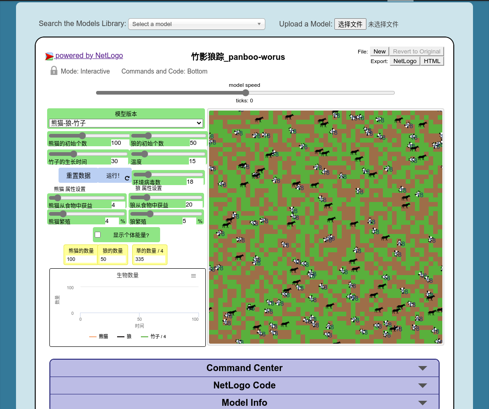
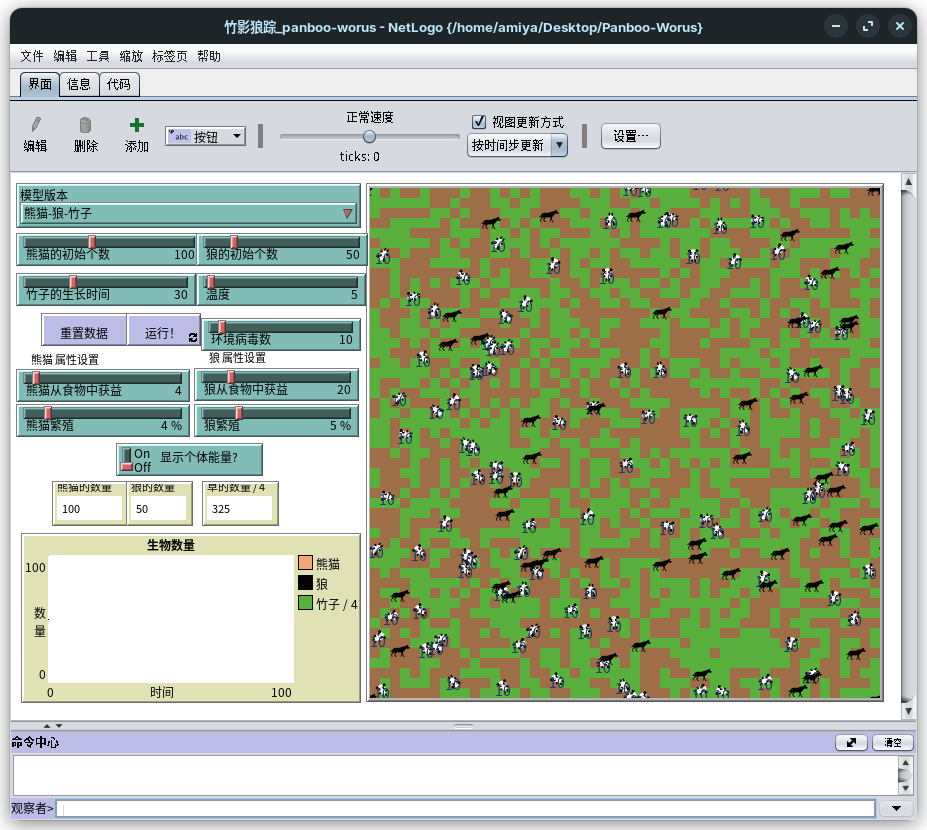

<!--
 * @Author: Amiya mc.amiya@qq.com
 * @Date: 2024-11-16 21:16:54
 * @LastEditors: Amiya mc.amiya@qq.com
 * @LastEditTime: 2024-11-22 23:57:22
 * @FilePath: /Panboo-Worus/README.md
 * @Description: 竹影狼踪的README文件
-->

<h2 align="center" style="font-weight: 600">竹影狼踪 (Panboo Worus)</h2>

    一个<s>抽象的</s>关于熊猫、竹子、狼在不同的温度以及病毒数量下发展模拟的程序
     
    你可以通过调整不同的初始值来获得多个不同的结局
     
     
    <a href="http://www.netlogoweb.org/launch#https://raw.githubusercontent.com/mcAmiya/Panboo-Worus/master/竹影狼踪_panboo-worus.nlogo" target="blank"><strong>🌎 在线访问</strong></a>  |  
    <a href="https://github.com/mcAmiya/Panboo-Worus/releases" target="blank"><strong>📦️ 下载使用</strong></a>

        

## ✨ 特性

- ✅ 拥有 `熊猫-狼-竹子` 和 `熊猫-狼` 两个模型版本
- 📃 拥有生物数量随时间变化图像
- 🧩 可自由配置各种生物的初始参数
- 💾 基于 [NetLogo](https://ccl.northwestern.edu/netlogo/) 开源可靠
- 🖥️ 拥有 [在线版](http://www.netlogoweb.org/launch#https://raw.githubusercontent.com/mcAmiya/Panboo-Worus/master/竹影狼踪_panboo-worus.nlogo) 和 [客户端版](https://ccl.northwestern.edu/netlogo/download.shtml) 支持不同设备使用

## 🧰 UI介绍

| 界面              | 作用                                                                                                                                   |
| ----------------- | -------------------------------------------------------------------------------------------------------------------------------------- |
| model speed       | 模型模拟速度                                                                                                                           |
| ticks             | 时间步长                                                                                                                               |
| 模型版本          | 拥有 `熊猫-狼-竹子` 和 `熊猫-狼` 两个模型版本                                                                                        |
| 熊猫初始个数      | 模拟开始前熊猫的初始个数                                                                                                               |
| 狼的初始个数      | 模拟开始前狼的初始个数                                                                                                                 |
| 竹子的生长时间    | 类似于冷却时间 越短竹子生长的越快                                                                                                      |
| 温度              | 初始温度默认会在0-40度之间 每10个时间步长 温度随机 上升 或 下降 1度 温度小于50度 或 温度大于50度时 有50%概率导致熊猫个体死亡 |
| 重置温度          | 用于初始化所有环境（环境病毒数 只可在 `重置数据`时才修改）                                                                           |
| 运行              | 开始根据设定的参数进行模拟                                                                                                             |
| 环境病毒数        | 初始化所有熊猫个体自身携带的病毒数量                                                                                                   |
| 熊猫从食物中获益  | 增加个体自身能量                                                                                                                       |
| 狼从食物中获益    | 增加个体自身能量                                                                                                                       |
| 熊猫繁殖          | 随机0-100之间的一个小数 如果小于 `熊猫繁殖` 自身能量消耗一半 且 诞生一个新熊猫个体                                              |
| 狼繁殖            | 随机0-100之间的一个小数 如果小于 `狼繁殖` 自身能量消耗一半 且 诞生一个新狼个体                                                  |
| 显示个体能量？    | 熊猫不可用 熊猫个体身上的标签已用于显示个体携带的病毒数量                                                                         |
| 熊猫的数量        | 当前模拟环境中熊猫个体数                                                                                                               |
| 狼的数量          | 当前模拟环境中狼个体数                                                                                                                 |
| 竹子的数量 / 4    | 当前模拟环境中草的数量 因过大影响图像观看 所以除四                                                                                     |
| 生物数量-时间图像 | 熊猫、狼、竹子(除以四) 数量随时间变化的图像                                                                                            |

## 💻 运行

1. 可以访问 [在线版](http://www.netlogoweb.org/launch#https://raw.githubusercontent.com/mcAmiya/Panboo-Worus/master/竹影狼踪_panboo-worus.nlogo)**（对网络环境有要求）**
2. 下载 [netlogo](https://ccl.northwestern.edu/netlogo/download.shtml) 和 [nlogo文件](https://github.com/mcAmiya/Panboo-Worus/releases) (需要网络环境) 打开运行

## 📜 开源许可

本项目基于 [NetLogo Wolf Sheep Predation](https://ccl.northwestern.edu/netlogo/models/WolfSheepPredation)

仅供学习研究使用，禁止用于商业及非法用途。

基于 [CC BY-NC-SA 3.0](https://creativecommons.org/licenses/by-nc-sa/3.0/) 许可进行开源。

欢迎提 Issue 和 Pull request。

## 🖼️ 截图

## 🏆 致谢

|         贡献         |       贡献者       |
| :------------------: | :----------------: |
| Wolf Sheep Predation | Wilensky & Reisman |
| 整体思路 & 熊猫外观 |     @CHAN LAM     |
